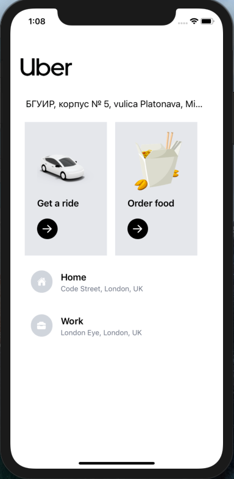

# Uber-ReactNative app
*Uber 2.0 with REACT NATIVE! (Navigation, Redux, Tailwind CSS & Google Autocomplete)*

 Use Tailwind CSS with RN for awesome styling!
👉  Use the Google Distance Matrix API to calculate Travel time and Distance (+ Cost!)
👉  Use the Directions Google API for real navigation!
👉  Use Google places API for real navigations!
👉  Use apple & google maps for iOS & Android 
👉  Use React Native Navigation to navigate between screens!
👉  Use React Native Elements to elevate your app design!

Run the app:
```sh
yarn
```
```sh
expo start
```

​

​  

​  

