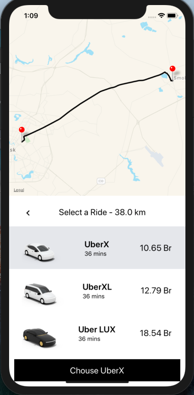
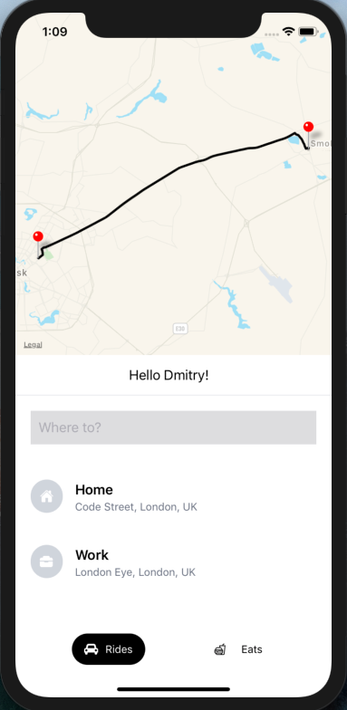

# Uber-ReactNative app

Run the app:
```sh
yarn
```
```sh
expo start
```

Then open [http://localhost:3000/](http://localhost:3000/) to see your app.<br>

​

Then open [http://localhost:5000/graphql/](http://localhost:5000/graphql/) to see your graphql schema.<br>

​  


